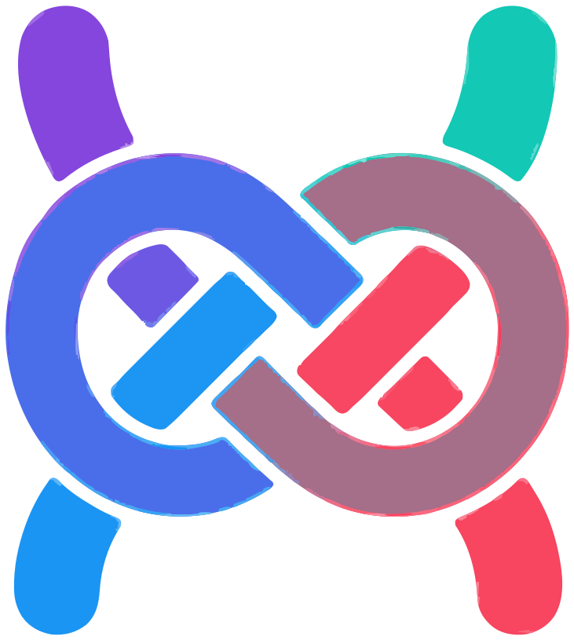

# Schat — a Slack-style client for Google Chat

<p align="center">
  
</p>

一個 **Slack 風格**的本地前端，用來操作你自己的 **Google Chat**。沒有後端、沒有 API key、沒有 OAuth —— 純 Chrome extension 橋接，搭你既有的、已登入的 `chat.google.com` 分頁便車，以你本人身分發出所有讀寫。

> ⚠️ 非官方、與 Google / Slack 無任何關聯的個人專案。詳見下方 [免責聲明](#免責聲明--disclaimer)。

> 把它想成「**Google Chat 官方網頁的遙控器 + 換皮**」，不是獨立 client。

---

## 架構

```
web/ (localhost:5173, Vite + React)
  └ window.postMessage {__sg}                 ↕
extension/app-bridge.js   （注入 localhost）
  └ chrome.runtime port 'sg-app'              ↕
extension/background.js   （hub：找 chat 分頁、轉送、廣播事件）
  └ chrome.tabs.sendMessage                   ↕
extension/content.js      （chat.google.com, isolated world, 純 relay）
  └ window.postMessage                        ↕
extension/inject-main.js  （chat.google.com, MAIN world）★唯一碰 Google Chat 私有協定處
  └ fetch / XHR → https://chat.google.com/u/0/api/...
```

- **RPC**：app `call(op,args)` → bridge → background → content → inject-main `handleOp` → 原路回。
- **事件**：inject-main `emitEvent` → content → background 廣播 → 所有 app → `on(event)`。

### 為什麼一定要開著 Google Chat 分頁

Google Chat 的 mutation endpoint 會檢查 Chrome native 注入的 anti-abuse 簽章（`x-browser-validation`，per-request 由 Chrome 計算、JS 攔不到）。後端直接打會 401。因此**所有讀寫都必須在 `chat.google.com` 的 origin 內由 Chrome 發送**——那個分頁就是「執行器」，**必須一直開著且已登入**。權限、身分、速率都跟你本人在原生網頁一模一樣。

---

## 安裝 & 啟動

需求：Node.js 18+、桌面版 Chrome、一個已登入的 Google Chat 帳號。

### 1. 啟動前端
```bash
cd web
npm install
npm run dev          # → http://localhost:5173
```

### 2. 載入 extension
1. Chrome → `chrome://extensions` → 右上開啟「**開發者模式**」。
2. 「**載入未封裝項目**」→ 選本專案的 `extension/` 目錄。

### 3. 開啟並登入 Google Chat
開一個分頁到 `https://chat.google.com/`，登入後**點開任一對話**（這步讓 extension 學到 session 的 xsrf / batchexecute 參數）。

### 4. 開啟前端
到 `http://localhost:5173`（或用 extension popup 的捷徑）。左側會列出你的頻道，點進去即可使用。

> **改 `web/*`** → Vite HMR 自動生效。**改 `extension/*`** → `chrome://extensions` 按 ↻ 重新整理，並在 chat 分頁 `Cmd/Ctrl+Shift+R` 強制重新注入。

---

## 功能

| 功能 | 說明 |
|------|------|
| 頻道 + DM 列表 | 自訂 section 分類、搜尋過濾；DM 以對方姓名命名 |
| 讀 / 送訊息、討論串回覆 | thread 分組顯示、右側 thread panel |
| **載入更早訊息** | 往前翻頁歷史 |
| Markdown WYSIWYG | `*粗* _斜_ ~刪~ \`code\` \`\`\`code block\`\`\``、連結、清單、@mention；清單 Enter 自動接續 |
| @mention | composer 自動完成、收到的高亮 |
| Emoji reaction（含自訂）| toggle 取消、hover 顯示按的人；**完整自訂 emoji 目錄**（分頁載入） |
| 收圖 / 貼圖送出 | 貼上即傳；收到的圖以公開 URL 直接顯示 |
| **新訊息通知** | 桌面通知 + 合成提示音；非當前頻道或分頁失焦時才響 |
| **排程訊息** | 送出旁的下拉選單（含 shadcn 風日期時間選擇器）；獨立頁面檢視 / 改時間 / 取消 |
| **新增頻道 / 新增自訂 emoji** | 直接在 sidebar 建立 |
| 訊息刪除 | hover 自己的訊息即可刪 |
| 深 / 淺色主題 | rail 上方切換、記憶設定 |

> 所有端點與 payload 形狀都是用封包擷取反推**現行 Google Chat (Dynamite) web client 的真實流量**、並以抓到的 response 離線驗證過。詳見 [`HANDOFF.md`](HANDOFF.md) 與 `docs/google-chat-api.md`。

---

## 目錄

```
extension/            Chrome MV3 橋接層
  manifest.json
  background.js       hub：port ↔ chat 分頁、廣播事件
  content.js          chat.google.com relay
  inject-main.js      ★核心：wire-format、被動攔截、所有 op 實作
  app-bridge.js       注入 localhost、橋接
  popup.html / popup.js
web/src/
  App.tsx             狀態 / 版面 / 連線 / 輪詢 / 事件 / 通知
  bridge.ts           postMessage RPC client
  notify.ts           桌面通知 + Web Audio 提示音
  components/         Sidebar / MessageList / MessageRow / ThreadPanel /
                      Composer / RichComposerInput / EmojiPicker /
                      DateTimePicker / ScheduledView / Logo
  richtext.tsx        訊息 markdown / 連結 / @mention / 清單渲染
docs/google-chat-api.md   逐欄位 API 筆記
HANDOFF.md                接手者全貌文件（架構、wire format、坑、op 一覽）
```

---

## 注意事項

- 這是**個人用、搭自己 session** 的工具，不是官方產品；Google Chat 改私有協定時可能需要重抓封包對照（見 `HANDOFF.md`）。
- 登入 session 由瀏覽器管理；被迫重新登入時，到 chat 分頁登入後本工具即自動恢復。

## 免責聲明 / Disclaimer

- **無關聯性**：本專案為獨立的個人開源專案，**與 Google LLC、Salesforce/Slack 並無任何關聯、亦未獲其認可或贊助**。"Google Chat"、"Slack" 及相關標誌為其各自所有者之商標；本專案名稱 **Schat** 與其圖示均為原創，文中提及 "Slack 風格" 僅為描述 UI 風格之指稱性使用（nominative use）。
- **僅限自用、授權範圍內**：本工具僅搭你**本人已登入**的 `chat.google.com` 分頁運作，存取範圍與你本人在官方網頁完全相同。**請僅用於你自己有權存取的帳號與內容**，勿用於未經授權之存取。
- **服務條款風險**：以非官方方式操作 Google Chat 私有介面，**可能違反 Google 的服務條款**，並可能導致帳號相關後果。是否使用、以及由此產生的一切風險與責任，由使用者自行承擔。若為公司／組織（Workspace）帳號，請另行確認所屬組織之政策。
- **無擔保**：本軟體依「現狀」提供，**不提供任何明示或默示之擔保**；作者不對任何資料遺失、帳號問題或其他損害負責。
- 本文件不構成法律意見；如有疑慮請諮詢專業人士。

> English summary: Independent, unofficial, personal project. **Not affiliated with, endorsed, or sponsored by Google or Slack/Salesforce.** Trademarks belong to their owners; "Schat" and its icon are original. The tool only acts through *your own* signed-in Google Chat session — use it solely with accounts and content you are authorized to access. Using unofficial interfaces **may violate Google's Terms of Service**; you assume all risk. Provided **"as is", without warranty of any kind**. Not legal advice.

## License

MIT — 見 [`LICENSE`](LICENSE)。
